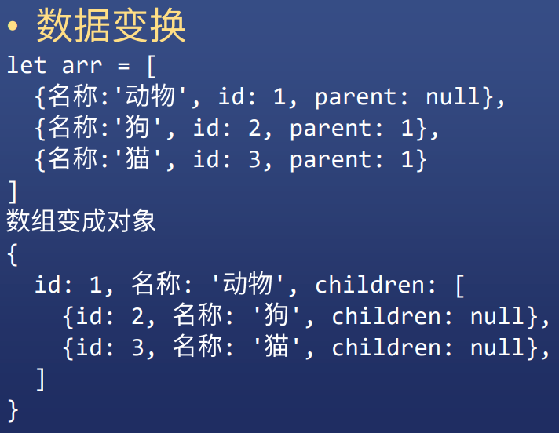
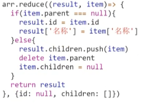

<!-- 03.12：1.5h -->
# JS 数组
在JS中，数组也是对象，一种特殊的对象。

典型的数组：
* 元素的数据类型相同
* 使用连续的内存存储
* 通过数字下标获取元素

JS的数组：
* 元素的数据类型可以不同
* 内存不一定是连续的（JS数组属于对象，而对象是随机存储的）
* 使用索引的时候，下标不是数字，而是字符串，即使长得跟数字一模一样。
* JS数组的下标和元素内容相当于键值对，而这个键（即索引）可以自己随便写，因为它是以字符串的形式存储的。

## 创建数组
JS创建数组可以通过三种方式：
* 新建

``` JavaScript
    let arr = [1,2,3]
    let arr = new Array(1,2,3)
    let arr = new Array(3) // 注意！当Array函数参数只有一个时，这个参数意思是“数组长度”。
    let arr1 = [4,5]
    let arr2 = arr1.concat(arr) // 合并数组
    let arr2 = arr.slice(1) // 首个元素被删除，剩下的被复制
    let arr2 = arr.slice(0) // 复制数组
    // JS只提供浅拷贝
```

* 转化

``` JavaScript
    let arr = '1,2,3'.split(',')
    let arr = '123'.split('')
    let arr = Array.from('123') // '123'属于伪数组
```

* 伪数组
JS的伪数组中，有 '0': xxx, '1': yyy, '2': zzz ..., length: x 这些元素特性，length元素一定要有，它的内容决定伪数组转为数组后，数组的长度。

伪数组的原型链中没有数组的原型。

``` JavaScript
    let divList = document.querySelectorAll('div') // 创建伪数组
    divArray = Array.from(divList) // 将伪数组转为数组
```

## 删除元素
虽然数组属于对象，而对象可以使用 delete arr['0'] 来删除元素，但是不建议使用这种方式来删除数组元素，否则会出现很多奇怪的现象。另外，对 arr['length'] 赋值也会修改数组内容，但也不要使用这种方式来修改数组。以下是常规的删除数组元素的方式：
``` JavaScript
    arr.shift() // 删除第一个元素
    arr.pop() // 删除最后一个元素
    arr.slice(index, 1) // 删除元素 arr[index] 
    arr.slice(index, n) // 从 arr[index] 开始，删除 n 个
    arr.slice(index, n, 'x', 'y', 'z') // 除了删除n个以外，还从 arr[index] 开始将 'x', 'y', 'z' 添加到数组中去。
```

## 查看元素
查看数组时，要留意有没有数组越界，即索引不存在：下标为复制，或者下标值超过了数组的长度。

1. 遍历

``` JavaScript
    for (let i = 0; i < arr.length; i++) {
        arr[i]
    }

    arr.forEach(function (x, y(可省略)) {
        x // 参数 x 指代数组元素内容
        y // 参数 y 指代数组下标，如果参数输入时省略，那么块中不能使用这个 y。
    })
```
``` JavaScript
    function forEach(arr, fn) {
        for (let i = 0; i < arr.length; i++) {
            fn(arr[i], i) {
                arr[i]
                i
            }
        }
    } // 这里对 forEach 函数稍作解析
```

<strong>注意：使用 for 遍历数组时不要用 in 关键字（如 for(let i in arr)），这个关键字是遍历普通对象时使用的，遍历数组使用 in 关键字有可能会出现奇怪现象。</strong>

上述中，对数组的遍历有 for 和 forEach 两种方式，它们的区别：for 在块内能写 break 或者 continue 来影响循环；而 forEach 函数则不行，它一旦开始就必须遍历所有元素。

1. 单个查看
``` JavaScript
    arr[0]
    arr['0']
```

## 增加元素
``` JavaScript
    arr.push('x','y','z')
    // 在 arr 末尾添加元素，返回新长度。
    arr.unshift('a','b','c')
    // 在 arr 首位添加元素，返回新长度。
    arr.splice(index, num, element)
    // 在 arr 索引为 index 处删除num个元素（num=0时则不删元素），再添加元素内容 element 到数组 arr 中。
```

## 修改元素
``` JavaScript
    arr.splice(index, num, element)
    // 在 arr 索引为 index 处删除num个元素（num=0时则不删元素），再添加元素内容 element 到数组 arr 中。
    arr.reverse() 
    // 数组倒序
    arr.sort((a,b)=> a-b)
    // 数组升序排序，当元素内容为对象时，则 a-b 要具体说明到底是对象中哪个属性做减法。
```

## 数组变换
``` JavaScript
    let arr =[1,2,3,4,5,6] // n 个元素的数组 arr

    arr.map(item=>item*item)
    // n 变 n
    arr.filter(item=>item%2===0)
    // n 变少，当返回值为真时则要，否则不要
    arr.reduce((sum,item)=>sum+item, 0)
    // n 变 1
```

reduce 是一个非常强大的函数，它能实现 map 和 filter 函数。
``` JavaScript
    let arr =[1,2,3,4,5,6] // n 个元素的数组 arr
    
    arr.map(item=>item*item)
    arr.reduce((res, e)=>res.concat(e*e), [])
    // 上述两个语句等价
    
    arr.filter(item=>item%2===0)
    arr.reduce((res, e)=>res.concat(e%2===0?e:[]),[])
    // 上述两个语句等价
```

## reduce 面试题



参考答案：


