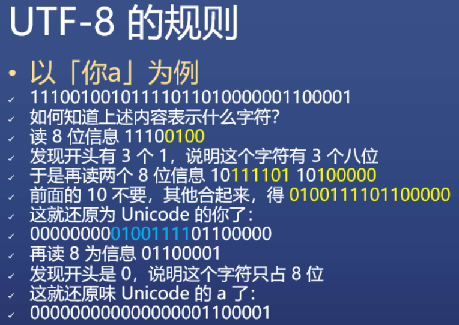
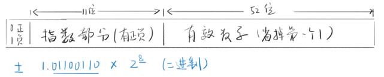

# JS 数据类型
不同的数据类型实现不同的功能。
## 数据存储
对于数字的存储，直接按照二进制的值来存储即可。对于字符，则需要先经过编码，获得对应的编码值之后再进行存储。
* ASCII码，能够存储128个字符信息，其中'0'=48，'A'=65，'a'=97。
* GB2312，中国国家标准局编写，主要为常见的6000多个汉字进行了编码。但是生僻字如“镕”没有在编码库里边。
* GBK，微软出手，为20000多个汉字（包括中日韩）和图形符号进行编码。
* Unicode，已经收录了13万字符（大于16位，2个字节），全世界通用。但是非常占存储空间。
* UTF-8，对应Unicode编码，但是节省存储空间。鸡贼存法：

## JS中7种数据类型
四基二空两对象：数字 number、字符串 string、布尔 bool、符号 symbol、空 undefined、空 null、对象 object。

数组、函数、日期等属于对象 object，不是JS的数据类型。

### 数字 number
包括整数、小数、科学计数（如1.23e4）。

特殊值：
* +0 和 -0（如 1/+0 不等于 1/-0）
* 无穷大：Infinity = +Infinity。-Infinity
* 不是数字的数字（或者说超出认知的数字）：NaN（Not a Number）

64位浮点数。浮点意思是小数点可以乱动。比如123.456=1.23456e10^2。

* 最大数字：Number.MAX_VALUE: 1.7976931348623157e+308
* 最小数字：Number.MIN_VALUE: 5e-324
* 15位10进制有效数字能够精确表示，对于16位10进制有效数字，小于90开头可以（将2^53作为参考值）。比如 9,110,000,000,000,001 无法精确表示。

### 字符串 string
