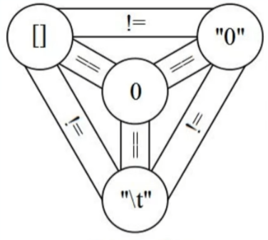

<!-- 03.27: 1.5h -->
# JS 运算符
常用的不做记录，记一些 JS 特别的运算符。

## 目录
算术运算符

比较运算符

布尔运算符

位运算

其他运算符

总结

## 算术运算符
* 指数运算：3 ** 2 等于 9
* 求值运算符：+x
* 负数运算符：-x

在 JS 中，字符串用 + 表示将两个字符串连接起来：‘1’+‘2’ 等于 ‘12’。还有一些奇怪的写法：
* +：3 + ‘4’ 等于 ‘34’。因为字符串有加号运算，所以 JS 会自动将非字符串数据转成字符串，再与其他字符串连接。
* -：‘4’ - 3 等于 1。应为字符串没有减号运算，JS 会自动将字符串转成数字，再与其他数字相减。

<strong>但是注意：在其他编程语言中，比如 Python、Ruby，如果你干上面那两种运算，它们会直接报错，跟你说“字符串只能和字符串进行加号运算，其他字符串运算是非法的”。所以不要写一些花里胡哨的字符串运算，即使 JS 不报错！！！</strong>

## 比较运算符
JS 的比较运算符有“模糊”和“精确”两种：
* 模糊：==、!=
* 精确：===、!==

JS 的模糊比较运算非常复杂，以下是 JS 著名的三位一体图：



<strong>因此，不要用模糊运算，用精确运算。</strong>JS 的精确运算：不同类型比较为“假”，基本类型比较值，对象类型比较地址。需要注意的几个精确比较：

* [] !== []，可以理解，因为两个空对象不一定地址相同。
* {} !== {}，理解同上。
* NaN !== NaN

## 布尔运算符
短路逻辑：
* console && console.log && console.log('hi')，意思是如果 console 存在，且 console.log 存在，那么就执行逻辑与运算最后部分：打印 hi。
* 在最新语法中，上述逻辑简写成：<strong>console?.log?.('hi')</strong>。非常简洁。
* a = a || 100，如果 a 有值，那么 a 为 a，如果 a 没有被赋值，那么默认为 100。（有 bug，如果 a 被赋值为 ''，因为 '' 属于 JS 中五个 falsy 值的一个，因此 a 也会被改为 100）
* 在最新语法中，给 a 默认值可以在函数形参位置直接写，比如：<strong>console.log(str='')</strong>，如果 str 没有赋值，那么控制台会默认打印空字符串 ''。

## 位运算
以下将介绍一些 JS 清奇的位运算，这些位运算工作中基本不会用到，但是可以应付面试。

面试时不准用 parInt() 意思这么清楚的函数来对浮点数取整的时候怎么办？在 JS 中，位运算只能作用于整数，因此浮点数做了位运算后会被向下取整：
* ~~ 6.123 等于 6
* 6.123 >> 0 等于 6
* 6.123 | 0 等于 6

面试中不准用 [a, b] = [b, a] 这么简洁的方式来互换 a 和 b 的值的时候怎么办？位运算的三句异或代码可以实现：
* a ^= b; b ^= a; a ^= b;

注意！！！<strong>异或互换值一般只对整数进行操作</strong>，其他类型数据不要使用这种方法，比如：浮点数不行，用了就转成整型；两个对象地址异或为 0。

## 其他运算符
* 点运算符。当基本类型后面有点时，JS会自动将这个基本类型数据封装成相应的对象，然后调用原型里的函数。执行完之后就把这个对象扔掉，把基本类型数据给回你。
  
``` JavaScript
    let a = 1;
    a.toString(); // 控制台打印 1

    a.xxx = 'xxx';
    a.xxx // 不报错，但控制台打印 undefined，因为对象用完之后立即被 JS 扔掉。
```

* void 运算符。返回值永远为 undefined。

* 逗号运算符，从左到右执行完所有语句后，取逗号中最后一个值作为返回值。<strong>一般都要和 () 一起用，否则容易被 JS 断句。</strong>

``` JavaScript
    let a = (1,2,3,4,5);
    console.log(a); // 打印 5

    let fn = a => {
        console.log(a);
        return a+1;
    };
    // fn 简写：
    let fn = a => console.log(a), a+1;
```

## 运算符优先级
* 从右到左：a=b=c=d=2，a、b、c、d 都赋值为 2。
* 从左到右：a+b+c+d。

详细的运算符优先级太多了，没几个人能记得清楚。写代码时可以通过加 () 来表明运算优先级，否则你写的优先级你同事不一定清楚。

建议：圆括号优先级最高，其他一概不知道。如果想知道，那么<a href='https://developer.mozilla.org/zh-CN/docs/Web/JavaScript/Reference/Operators/Operator_Precedence'> mdn 参考文档等着你去记</a>。

## 总结
* 比较运算符 ==、!= 不要用。
* 算术运算符 ++、-- 除非 for 循环，否则不要用。
* 运算符优先级不要记。记了也会忘，没忘加分项也是可有可无。
