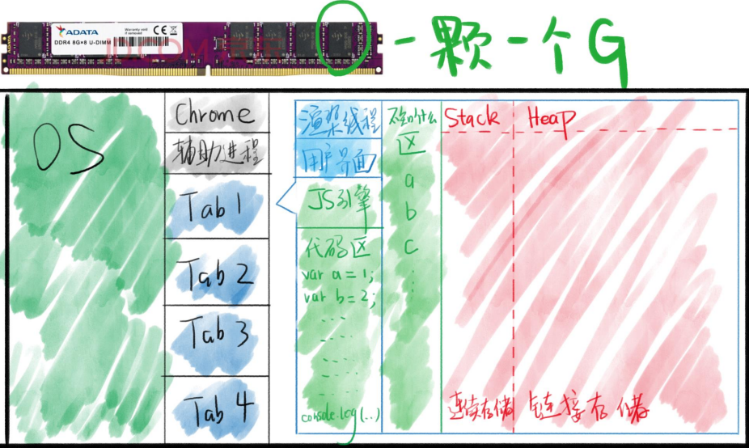
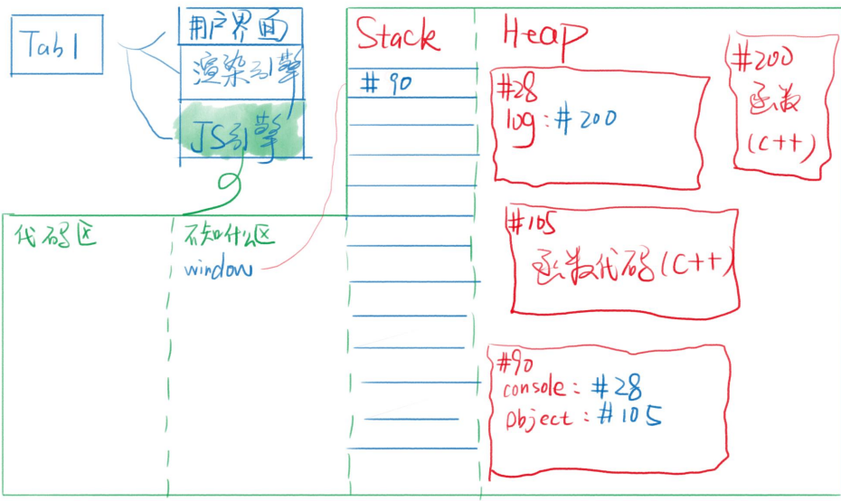

<!-- 03.08 -->
# JS 概述
* OS：Operating System 操作系统。
* bash：是一种shell，ba指代人名。
* 每开一个网页就开一个进程，但有时相同的域名会归为同一个进程。
* 对于浏览器，“渲染”界面指的是下载和解析HTML以及CSS，然后显示在屏幕上。
* 对于前端工程师来说，有渲染引擎和JS引擎，JS引擎指的是解析和执行JS。
* 高频语：“JS是单线程的”，“DOM操作慢”。

## JS 引擎
JS引擎常见的包括V8引擎、Chakra，Chrome使用V8引擎，Edge之前使用的是Chakra，而最新版本使用的也是V8引擎。V8引擎由目前新能最快的编程语言（C++）编写而成。
JS引擎主要功能包括四部分：编译代码、优化代码、执行、垃圾回收。初步先了解执行部分，其他部分知识内容比较深，尤其是优化代码部分。

执行JS代码：首先浏览器提供API（比如window、document、setTimeout等），这些API不是JS自身功能，这些功能是JS的运行环境，把JS放进页面后就开始执行JS。

## 内存图
JS在内存中运行。

上图不完整，还有“调用栈”、“任务队列“等区域没有画。变量名在“不知道什么区”中存储，该区域每种浏览器的分配规则不一样。红色区域需要了解。

Stack栈顺序存储，Heap堆随机存储（为什么分这两个区？如果，随机存储的内容放到顺序存储中，那么当这个内容为对象时，对象增删会使得顺序存储空间完全乱套）。

非对象都存储在Stack中，对象都存储在Heap中。

## window

注意，window变量和window对象的概念是不一样的。window变量存放了window对象的地址；window对象是Heap中的一堆数据。如果编写 var xxx = window，那么就可以直接使用xxx来调用window对象里的内容。

## prototype 原型
JS对象都有个隐藏属性，这个隐藏属性指向的对象就是原型，原型包含了日常使用的共同属性。
* 首字母大写的对象里就有原型。
* 所有对象都有隐藏属性"\_\_proto__"，指向原型，首字母大写的对象也有隐藏属性，暂不深究。
* 原型作用：因为原型里封装了共同属性，所以能够节省代码，节省内存。
* 原型也是对象，因此原型也有原型，window.Object.prototype指向的对象包含了所有对象的共有属性，它（原型）是<storng>对象的根</strong>，它的原型指向 null。
* Window.\_\_proto__ = EventTarget, EventTarget.\_\_proto__ = Function.prototype

