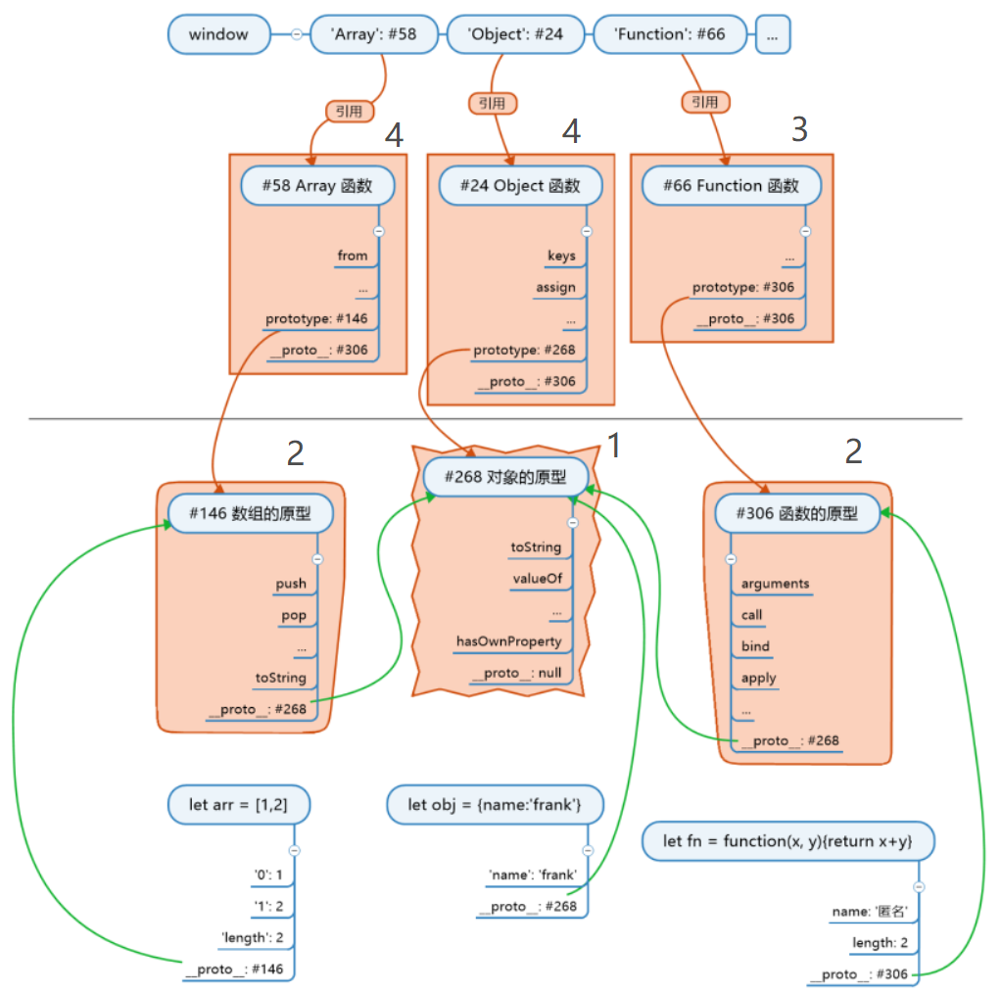

<!-- 03.29: 1h -->
# JS 总结
## JS 难点
三座大山：原型，this，AJAX。

## JS 三个基本知识
1. 公式：对象.\_\_proto__ = 其构造函数.prototype
2. 根公理：Object.prototype 指向的对象是所有对象的直接或间接原型
3. 函数公理：所有函数都是由 Function 构造的，包括 Object、Array、Function。

由 1 和 3 可以推出：任何函数.\_\_proto__ 直接或间接等于 Function.prototype。

## JS 世界的构造顺序

## JS 学习大纲
* 第一阶段：了解 JS，语法、特性、对象、数组、函数等。
* 第二阶段：学习 AJAX、设计模式、封装、面向对象、MVC。
* 第三阶段：框架 Vue、React。